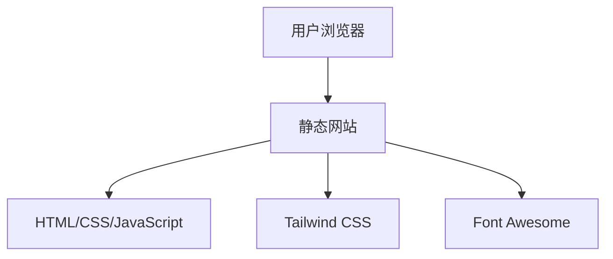

## 1. Architecture Design

## 2. Technology Description
- Frontend: 纯静态HTML + CSS + JavaScript
- 样式框架: Tailwind CSS@3
- 图标库: Font Awesome
- 构建工具: 无需构建工具，纯静态文件
- 部署: Cloudflare Pages

## 3. Route Definitions
| Route | Purpose |
|-------|---------|
| / | 首页，包含个人简介和课程列表 |

## 4. API Definitions
- 不适用，本项目为纯静态页面，无后端API

## 5. Server Architecture Diagram
- 不适用，本项目为纯静态页面，无后端服务器

## 6. Data Model
- 不适用，本项目为纯静态页面，无数据库